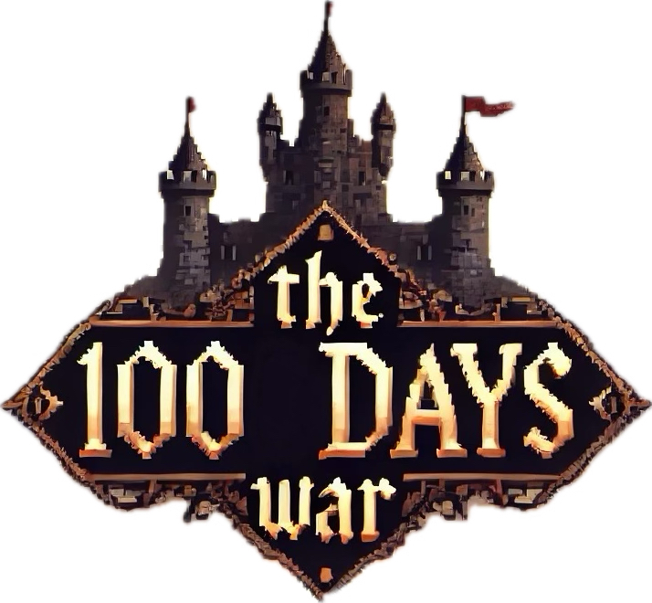
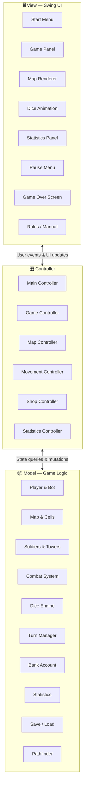

<p align="center">
  
</p>

<h1 align="center">⚔️ 100 Days War</h1>

<p align="center">
  <em>A turn-based strategy game inspired by <a href="https://www.conq.io/">Conq.io</a>, built with Java &amp; Swing.</em>
</p>

<p align="center">
  <a href="https://github.com/Gianmarco-Fabbri/OOP23-100DaysWar/blob/main/LICENSE"></a>
  <a href="https://www.java.com/"></a>
  <a href="https://gradle.org/"></a>
  <a href="https://github.com/Gianmarco-Fabbri/OOP23-100DaysWar/releases"></a>
  <a href="https://github.com/Gianmarco-Fabbri/OOP23-100DaysWar"></a>
  <a href="https://github.com/Gianmarco-Fabbri/OOP23-100DaysWar/issues"></a>
</p>

---

## 📖 About

**100 Days War** is a simplified, single-player strategy game where the player competes against an AI bot on a procedurally generated map. Each match spans **100 virtual days** — every day is simulated within a few seconds — and the goal is to conquer the opponent's spawn cell or control the most territory by the end of the war.

> **University Project** — Developed as part of the *Object-Oriented Programming* course (A.Y. 2023/2024) at the [University of Bologna](https://www.unibo.it/).

---

## 🎮 How It Works

1. **🏁 Launch** — Enter a username, then choose to start a new game or load a previous save.
2. **🗺️ Map Generation** — A procedurally generated grid assigns spawn cells to the player and the bot.
3. **📅 Day Cycle** — The game runs for up to 100 days. If a player doesn't make a move for **4 consecutive days**, the turn automatically passes.
4. **💰 Economy** — Earn coins each turn to buy, place, or upgrade units.
5. **🛡️ Defense** — Build **defensive towers** (up to level 4) to protect your territory.
6. **⚔️ Offense** — Deploy and move **soldiers** (up to level 3) across the map.
7. **🎲 Combat** — When a soldier enters an enemy-occupied cell, combat is resolved via a **dice-roll system** scaled by each unit's level. Highest total wins.
8. **🏆 Victory** — Capture the opponent's spawn cell for an early win, or hold the most cells after 100 days.

---

## 🏗️ Architecture

The project follows the **Model-View-Controller (MVC)** architectural pattern, ensuring a clean separation of concerns across the codebase.



---

## ✨ Features

### Core Features

| Feature | Description |
|:--------|:------------|
| 🗺️ **Procedural Map** | Dynamically generated grid with spawn points and obstacles |
| 🤖 **AI Opponent** | Bot with strategic decision-making |
| ⚔️ **Dice Combat** | Level-scaled dice-roll battle resolution |
| 💰 **Economy System** | Coin-based purchasing and upgrading of units |
| 🛡️ **Tower Defense** | Multiple tower types with up to 4 upgrade levels |
| 🏃 **Soldier Movement** | Pathfinding-based soldier deployment and repositioning |
| 📊 **Live Statistics** | Real-time game stats displayed during play |
| 💾 **Save & Load** | Persist and resume your last game session |
| 📜 **In-Game Manual** | Detailed rules and gameplay guide |

### Optional / Bonus Features

| Feature | Description |
|:--------|:------------|
| 🏰 **Tower Variants** | Different defensive tower types with unique properties |
| 🧠 **Smarter Bot** | Enhanced AI strategy |
| ⭐ **Bonus Cells** | Special cells with unique effects on the map |

---

## 🚀 Getting Started

### Prerequisites

- **Java 17** or higher
- **Gradle** (wrapper included)

### Run from Source

```bash
# Clone the repository
git clone https://github.com/Gianmarco-Fabbri/OOP23-100DaysWar.git
cd OOP23-100DaysWar

# Build and run
./gradlew run
```

### Run the Pre-Built JAR

```bash
java -jar OOP23-100DaysWar-all.jar
```

### Build a Fat JAR

```bash
./gradlew shadowJar
# Output: build/libs/OOP23-100DaysWar-all.jar
```

---

## 🧪 Testing

The project includes **19 test classes** powered by JUnit 5.

```bash
./gradlew test
```

---

## 🤝 Team & Contributions

This project was developed by a team of four as part of a university course.

| Member | Responsibilities |
|:-------|:-----------------|
| **Bartolini** | 🖥️ Start menu UI · 🗺️ Game map rendering · 🛡️ Tower system & interactions |
| **Balzani** | 💰 Coin system & shop UI · 🎲 Dice implementation · 💾 Save & load functionality |
| **Fabbri** | 🏃 Soldier system & interactions · 🤖 AI bot · 📊 Real-time statistics |
| **Francalanci** | ⚔️ Combat system · 📅 Turn management · 📜 In-game manual · 🏆 End-game logic |

### 🖥️ Bartolini

- Implementation of the **coin system**, the related shop menu, and its display in the main game panel
- Implementation and visualization of the **game map**

### 💰 Balzani

- Implementation and visualization of **defensive towers** and their interactions
- Implementation and visualization of the **dice** system
- Implementation and visualization of the **start menu** panel
- Management of **game save and load** functionality

### 🏃 Fabbri

- Implementation and visualization of **soldiers** and their interactions
- Implementation of the **AI bot** opponent
- Implementation and visualization of **real-time game statistics**

### ⚔️ Francalanci

- Implementation and visualization of **soldier combat**
- Implementation and visualization of **turn progression**
- Implementation of the **in-game rules manual** (logic and UI)
- Management of **end-of-game** conditions

---

## 🏛️ Key Design Challenges

- ✅ Strict adherence to the **MVC pattern** with clean dependency management
- ✅ Effective **Git collaboration** workflow across four team members
- ✅ Balanced **workload distribution** and parallel development
- ✅ Fine-tuned **day-cycle speed** control for optimal gameplay pacing

---

## 📄 License

This project is licensed under the **MIT License** — see the [LICENSE](LICENSE) file for details.

---

<p align="center">
  Made with ❤️ at the University of Bologna
</p>